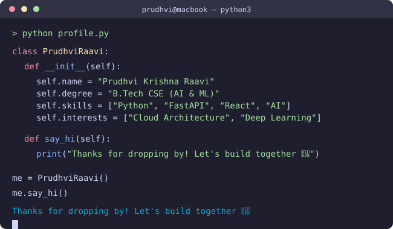
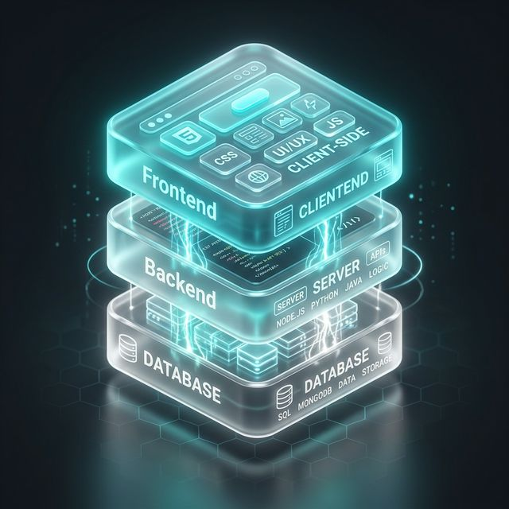

 

 

 

---

## 👨‍💻 About Me

<table align="center" border="0">
  <tr>
    <td align="center" width="50%">
      
    </td>
    <td align="center" width="50%">
      
    </td>
  </tr>
</table>

- 👋 Hi, I’m **Prudhvi Krishna Raavi**
- 🎓 Final Year Student & Aspiring AI Engineer
- 💻 Passionate about **Full Stack Development** & **Artificial Intelligence**
- 🚀 Expert in building high-performance, AI-integrated web applications
- 📚 Currently exploring **Deep Learning** & **Cloud Architecture**
- 💬 Ask me about **FastAPI, React, or LLMs**
- ⚡ Fun fact: I build apps faster than I drink caffeine!

---

<h2 align="center">💎 Core Expertise</h2>

<table align="center" border="0">
  <tr>
    <td align="center">
       
      <b>Artificial Intelligence</b>
    </td>
    <td align="center">
       
      <b>Full Stack Web</b>
    </td>
    <td align="center">
       
      <b>Cloud & Infra</b>
    </td>
  </tr>
</table>

  
  
  
  
  
  

---

<h2 align="center">💻 Technologies & Tools</h2>

  <b>Languages & Core</b> 
  
  
  
  
  

  <b>Frontend Development</b> 
  
  
  
  
  

  <b>Backend & AI</b> 
  
  
  
  
  

  <b>Cloud & Infrastructure</b> 
  
  
  
  

---

<h2 align="center">📊 GitHub Insights</h2>

  
  

  

---

<h2 align="center">🐍 Contribution Snake</h2>

  

---

<h2 align="center">🚀 Featured Repositories</h2>

  
  

---

  Built with curiosity, caffeine, and a little bit of chaos ☕ ⚡
   
  <b>🌟 Star some repos if you find them useful — it means a lot!</b>

